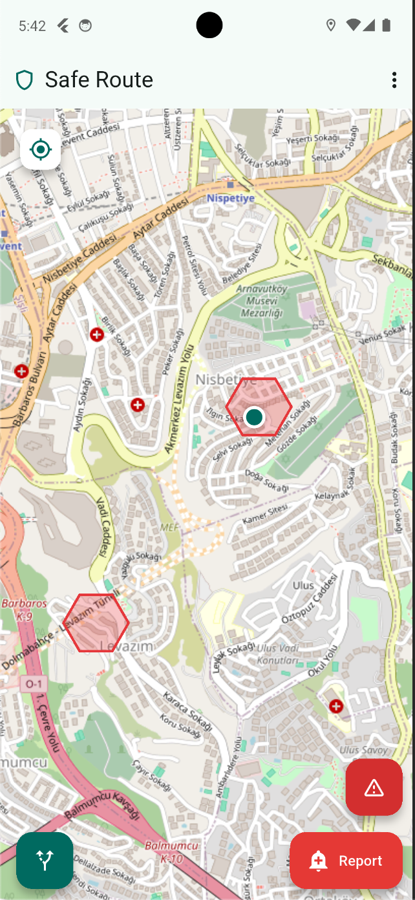
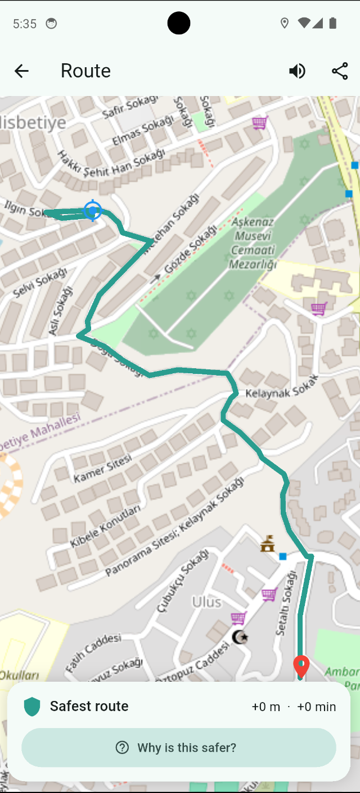
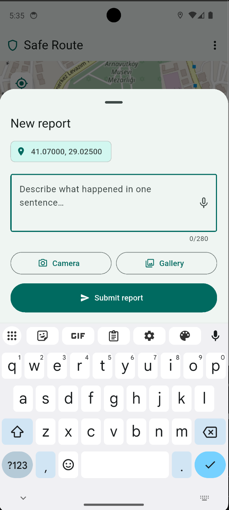

<div align="center">

# 🛡️ Safe Route
 
### Topluluk destekli, on-device Gemma 4 ile güvenli yaya navigasyonu
 
[](https://flutter.dev)
[](https://ai.google.dev/gemma)
[](LICENSE)
[](https://www.kaggle.com/competitions/gemma-4-good-hackathon)
[](https://developer.android.com)
[]()
 
</div>
---
 
> **"Google Maps gibi — ama hangi sokaktan *kaçınman* gerektiğini söyler."**
 
Safe Route, tamamen **telefon üzerinde** çalışan bir yaya güvenliği navigasyon uygulamasıdır. Topluluk üyeleri tek cümlelik güvenlik bildirimleri gönderir; Gemma 4 bunları gerçek zamanlı olarak on-device sınıflandırır; uygulama canlı bir risk haritası oluşturur ve A→B arasında **iki rota** sunar: en kısa (gri) ve en güvenli (yeşil). Kara kutu yok, bulut AI yok, gizlilik ihlali yok.
 
**Kaggle × Google DeepMind Gemma 4 Good Hackathon** — Güvenlik kategorisi için geliştirildi.
 
---
 
## 📋 İçindekiler
 
- [Problem](#-problem--güven-boşluğu)
- [Kimler İçin](#-kimler-için)
- [Demo](#-demo)
- [Nasıl Çalışır](#-nasıl-çalışır)
- [Gemma 4 Kullanımı](#-gemma-4-nasıl-kullanılıyor)
- [Risk Modeli](#-saydam-risk-modeli)
- [Rota Planlama](#-rota-planlama)
- [Mimari](#-mimari)
- [Teknoloji Yığını](#-teknoloji-yığını)
- [Kurulum](#-kurulum)
- [Proje Yapısı](#-proje-yapısı)
- [Değerlendirme](#-değerlendirme)
- [Sınırlamalar](#-bilinen-sınırlamalar)
- [Hackathon](#-hackathon)
---
 
## 🚨 Problem — Güven Boşluğu
 
Kentlerde yaşayan yayalar rota kararlarını **güvenlik sezgisine** göre verir — geçmiş deneyimlerden ve kulaktan kulağa yayılan bilgilerden şekillenen bir sezgi. Bu kolektif bilgi var, ama onu yüzey çıkaracak bir altyapı hiç olmadı.
 
Mevcut navigasyon uygulamaları süre ve mesafeyi optimize eder. Hiçbiri *algılanan güvenliği* hesaba katmaz.
 
### Sayılarla Sorunun Büyüklüğü
 
| Veri | Kaynak |
|---|---|
| 1972'de okula yalnız giden 7–8 yaş İngiliz çocuğu: **%80** → 1990'da **%9** | Policy Studies Institute, UK |
| 1969'da yürüyerek okula giden ABD'li çocuk: **%48** → 2009'da **%13** | National Center for Safe Routes to School |
| Sabah trafik yükünün **%10–14'ü** ebeveynlerin çocuklarını okula götürmesinden kaynaklanıyor | Safe Routes to School Partnership |
| ABD'de yılda ortalama **67.124 çocuk** yaya olarak yaralanıyor; **704'ü** hayatını kaybediyor | Children's Safety Network |
| 16 yaş altı çocuk ölümlerinin **%36'sı** saat 15:00–19:00 arasında — tam okul çıkış saatlerinde | Children's Safety Network |
| Ebeveynlerin **%46'sı** çocuğunu yürüterek okula göndermeme sebebi: trafik tehlikesi; **%11'i**: suç | CDC, 2018 |
 
**Asıl kırılma:** Bu ebeveynlerin elinde somut, gerçek zamanlı, sokak bazında bilgi olsaydı karar vermek çok daha kolay olurdu. Safe Route tam da bunu sağlar.
 
---
 
## 👥 Kimler İçin?
 
### 🧒 Çocuklar — Okul Yolu Artık Gözle Görülür Olabilir
 
Çocukların bağımsız hareket özgürlüğü son 50 yılda dramatik biçimde daraldı. Sokaklar daha mı tehlikeli oldu? Belki biraz. Ama asıl sorun **görünmezlik**: ebeveynler tehlikeyi hisseder ama somut, sokak bazında bir bilgiye sahip değildir.
 
#### Okul Yolu Senaryosu
 
Selin, 10 yaşında. Sabah 08:15'te evden çıkar, okula yürür. Geçtiği bir sokakta kapı önünde duran, birkaç kez seslenen bir yabancıyla karşılaşır.
 
**Selin uygulamayı açar ve tek cümle yazar:**
 
> *"Okul yolunda bir yabancı kapı önünde bekliyordu, defalarca seslendi."*
 
**Arka planda 3 saniyede:**
 
```
Gemma 4 E2B (on-device):
  → category:      "suspicious_behavior"
  → riskLevel:     "medium"
  → timeSensitive: true
  → explanation:   "Yabancının ısrarcı iletişim girişimi — sabah okul saatinde orta risk"
 
RiskEngine:
  → O sokağın geohash-7 hücresi kırmızıya döner
  → surge_factor güncellendi
 
Firestore (< 5s):
  → Diğer tüm cihazlarda o hücre pulse animasyonu yapar
```
 
**10 dakika sonra aynı sokaktan geçmek isteyen Ahmet (11 yaşında) ne görür?**
 
Haritada o hücre kırmızı. Rota istediğinde:
 
- **Gri rota:** En kısa — ama o sokaktan geçiyor
- **Yeşil rota:** +180m, +2dk — ama o bloktan tamamen kaçınıyor
"Neden daha güvenli?" butonuna basınca:
 
> *"Bu güzergah, bugün sabah şüpheli davranış bildirilen Çiçek Sokak'ı atlıyor. Bildirim 12 dakika önce geldi (gece çarpanı yok, yoğunluk çarpanı: 1.3)."*
 
Ahmet o sokaktan geçmez. Neden geçmemesi gerektiğini de bilir.
 
---
 
### 👩 Kadınlar
 
Geç saatte yalnız yürürken kaçınılacak güzergahları gerçek zamanlı olarak görür. Taciz veya takip bildirimleri gece çarpanıyla (**×1.5**) otomatik olarak ağırlaştırılır ve komşu hücreler de etkilenir.
 
### 👴 Yaşlılar ve Dezavantajlı Gruplar
 
Uygulamanın arka planında çalışan risk motoru herhangi bir ML eğitimi gerektirmez — veriler ağ olmasa da SQLite üzerinden local çalışır. Hesap açmak gerekmez, anonim auth otomatik atanır.
 
### 🌐 Herkes
 
> **"Biri görür, bildirir. Bir sonraki yaya geçmez."**
 
Safe Route'un topluluk zinciri budur. Her bildirim, o sokağı kullanan tüm kullanıcılara gerçek zamanlı olarak ulaşır.
 
---
 
## 🎬 Demo
 
[▶ 3 dakikalık demo videosu izle](https://youtube.com/...)
 
| Risk Haritası | Güvenli vs Kısa Rota | Güvenlik Bildirimi |
|:---:|:---:|:---:|
|  |  |  |
| Hex hücreli heatmap, canlı pulse animasyonu | Yeşil (güvenli) vs gri (kısa), +180m farkı | Tek cümle, ses/fotoğraf, &lt;5s senkronizasyon |
 
**Demoda öne çıkan anlar:**
- Model indirme → uygulama ilk açılış
- Canlı bildirim gönderimi → diğer cihazda **< 5 saniye** pulse animasyonu
- Güvenli vs kısa rota karşılaştırması — +180m / +2dk trade-off etiketi
- "Neden daha güvenli?" 3 katmanlı açıklama ekranı
- Acil durum butonu → SMS deeplink
---
 
## ⚙️ Nasıl Çalışır?
 
### Temel Döngü (uçtan uca < 5 saniye)
 
```
1. Kullanıcı Bildir'e basar → tek cümle yazar
2. Gemma 4 E2B sınıflandırır on-device → kategori, risk, açıklama
3. RiskEngine o sokağın hex hücresini yeniden hesaplar
4. Diğer cihazlar Firestore üzerinden pulse animasyonu alır
```
 
### Tam Pipeline
 
```
Kullanıcı bildirimi (1 cümle)          GPS konumu
        │                                   │
        └──────────────┬────────────────────┘
                       ▼
           ReportsRepository
           SQLite write → status: PENDING
           [< 100ms — "Rapor alındı" snackbar]
                       │
                       ▼
         ┌─────────────────────────────┐
         │   GemmaService.classify     │  ← on-device, ~3s
         │   Gemma 4 E2B               │
         │   prompts.dart (kilitli)    │
         └─────────────┬───────────────┘
                       │
                       ▼
              Classification
       {category, riskLevel, timeSensitive,
        confidence, explanation}
                       │
          SQLite UPDATE → status: CLASSIFIED
                       │
          ┌────────────┴────────────┐
          ▼                         ▼
  RiskEngine                  SyncService
  recomputeCell(geohash7)     mirror → Firestore
  risk_cells güncellendi      pulse: true flag
          │                         │
          ▼                         ▼
  Heatmap güncellendi       Diğer cihazlar
  (1s refresh)              pulse animate (< 5s)
          │
          │  [rota isteği varsa]
          ▼
  RoutingService.findRoutes(from, to, time)
  ├─ OSM graph → nearestNode snap
  ├─ A* + Yen K-Shortest (K=5)
  ├─ risk_rerank: cost = distance + α × Σ risk
  └─ GemmaService.summarizeCell [E4B, ~7s, 5dk cache]
          │
          ▼
     RouteResult
     shortest (gri) + safest (yeşil)
     + avoidedCells + 3-katman açıklama
```
 
---
 
## 🧠 Gemma 4 Nasıl Kullanılıyor?
 
Safe Route, **hot-swap mimarisiyle** iki Gemma 4 edge modeli kullanır. Aynı anda her ikisi de bellekte tutulamaz (Pixel 7, 8 GB RAM); `setActive(spec)` ile gerektiğinde yükleme yapılır.
 
| Model | Görev | Gecikme | Sıklık |
|---|---|---|---|
| **Gemma 4 E2B** (~2.58 GB) | Bildirim sınıflandırma | ~3s | Her bildirimde |
| **Gemma 4 E4B** (~3.65 GB) | Kaçınılan alan özeti | ~7s | Rota başına, 5dk cache |
 
### E2B — Bildirim Sınıflandırma
 
Her gelen bildirimi yapılandırılmış bir nesneye dönüştürür:
 
```json
{
  "category": "harassment",
  "riskLevel": "medium",
  "timeSensitive": true,
  "confidence": 0.87,
  "explanation": "Kişiyi takip eden iki kişi — akşam erken saatlerinde yüksek risk"
}
```
 
- `prompts.dart` içindeki sistem prompt **kilitlidir** — eval determinizmi için değiştirilmez
- `parser.dart` JSON yanıtı parse eder; hata durumunda retry + safe-default
- Format: `.litertlm` container (LiteRT-LM), GPU + CPU fallback
### E4B — Alan Özeti
 
Rota planlamasında kaçınılan hücreleri doğal dille özetler:
 
> *"Bu güzergah, bu gece 3 olay bildirilen Barbaros Bulvarı'nı atlıyor."*
 
- 5 dakikalık cache: aynı hücre için tekrar tekrar E4B çağrılmaz
- Hot-swap: E2B unload → E4B load → önbellek süresi dolunca geri
### Neden On-Device?
 
Kişisel güvenlik bildirimleri en hassas verilerden biridir. *"Gece 23:00'de X yakınında takip edildim"* ifadesi konum, saat, rutin ve kırılganlık bilgisi içerir. Bulut çıkarımı — güvenilir bir sağlayıcıyla bile olsa — bu veri için uygun değildir.
 
**On-device çıkarım gizliliği politikaya değil, yapıya bağlar.**
 
Firestore yalnızca cihazlar arası senkronizasyon içindir. AI inference asla bulutta çalışmaz.
 
---
 
## 🔍 Saydam Risk Modeli (ML Eğitimi Yok)
 
Kasıtlı olarak eğitilmiş bir risk modeli kullanmadık. Her risk skoru kamuya açık, denetlenebilir bir formüldür:
 
```
predicted_risk(hücre, t) = base_risk(hücre) × surge_factor(hücre, t) × time_factor(t)
```
 
| Çarpan | Formül | Varsayılan |
|---|---|---|
| `categoryWeight` | şiddet: 1.0 / hırsızlık: 0.8 / taciz: 0.7 / şüpheli: 0.5 / vandalizm: 0.4 / diğer: 0.3 | sabit |
| `severityWeight` | yüksek: 1.0 / orta: 0.7 / düşük: 0.4 | sabit |
| `decay` | `exp(−gün_yaşı / 7)` | 7 günlük yarı-ömür |
| `reputationFor(uid)` | `clamp([0.5, 1.5])` | kullanıcı başına |
| `surgeFactor` | `1 + min(2.0, son_2s × 0.3)` | maksimum 3.0 |
| `timeFactor` | `22:00 ≤ t < 05:00` ise **1.5**, diğer: 1.0 | gece çarpanı |
 
**Kullanıcı arayüzü bu sayıları aynen gösterir.** Formüle güvenin, bize değil.
 
Bu özellikle güvenlik uygulamaları için kritiktir: opak "AI güvenlik skorları" tarafsızlık yanılsaması yaratırken önyargıyı gizler. Açık formüller denetlenebilirdir.
 
---
 
## 🗺️ Rota Planlama
 
### Algoritma
 
```
RoutingService.findRoutes(from, to, time)
  ├─ OsmGraph.nearestNode(from), nearestNode(to)   ← yürünebilir yola snap
  ├─ YenKShortestPaths(K=5)                         ← A* base + spur path'ler
  ├─ Tüm adayların geçtiği geohash hücrelerini topla
  ├─ RiskEngine.predictedRisk(cell, time)           ← pre-compute cache
  ├─ RiskRerank: cost = length + α × Σ risk         ← α default 100m
  ├─ GemmaService.summarizeCell (E4B)               ← top-3 avoided cell
  └─ RouteResult { shortest, safest, avoidedCells, explanation }
```
 
- **OSM grafiği:** `app/assets/road_graph.bin` (~1.1 MB Beşiktaş yaya ağı), `tools/extract_osm.py` ile osmium'dan üretilir
- **A\*:** `astar.dart` + Haversine heuristic + özel `MinHeap` — saf Dart, harici bağımlılık yok
- **Yen K-Shortest:** 5 alternatif yol; `risk_rerank.dart` her birinin maliyetini `mesafe + α × risk` ile yeniden hesaplar
### 3 Katmanlı Açıklama
 
"Neden daha güvenli?" butonuna basıldığında:
 
| Katman | İçerik |
|---|---|
| **1. Rota düzeyi** | E4B özeti + kaçınılan hücre sayısı, gece çarpanı, surge çarpanı, mesafe farkı |
| **2. Hücre düzeyi** | Herhangi bir kaçınılan alana dokunulduğunda o alanı besleyen topluluk bildirimleri + Gemma'nın nötr açıklaması |
| **3. Zamansal** | `base × 1.5 gece × 2.0 surge` çarpanları birebir gösterilir |
 
Uygulama **"AI öyle düşünüyor ki..."** demez. Sayıları ve modeli doğrudan **alıntılar**.
 
---
 
## 🏗️ Mimari
 
### Boot Sırası
 
```
1. WidgetsFlutterBinding.ensureInitialized()
2. GemmaService init       ← mevcut ağırlık var mı kontrol et
3. LocalDb open            ← sqflite migrations
4. Firebase.initializeApp  ← yoksa skip (graceful)
5. SeedLoader.ensureSeeded ← ilk açılışta 50 sentetik bildirim yükle
6. GemmaService.warmUp     ← E2B engine'i sıcak tut
7. runApp(ProviderScope(overrides: [...realProviders...]))
```
 
### Depolama Katmanı — Çevrimdışı-Önce
 
```
┌────────────────────────────────────┐
│ SQLite (sqflite) — gerçek kaynak   │   ← tüm write'lar buraya, < 100ms
│   tables: reports, risk_cells,     │
│           classifications, sync    │
└──────────────┬─────────────────────┘
               │ mirror (async, retry'lı)
               ▼
┌────────────────────────────────────┐
│ Firestore — yalnızca senkronizasyon│   ← cihazlar arası dağıtım
│ Anonim Auth UID = cihaz başına     │
└────────────────────────────────────┘
```
 
### Bağımlılık Tersine Çevirme — `*Like` Provider Pattern
 
```
features/providers.dart   ← Like abstract interface'ler
                            ReportsRepositoryLike, RiskEngineLike,
                            RoutingServiceLike, GemmaServiceLike...
 
app/real_providers.dart   ← Adapter'lar: gerçek sınıfları Like'a uyarla
 
main.dart                 ← ProviderScope.overrideWith(...)
```
 
UI her zaman `*Like` arayüze bağlıdır. Test fixture'lar mock Like döner. Modüller bağımsız evrilir.
 
### Acil Durum Butonu
 
```
EmergencyAction.trigger()
  1. LocationService.currentPosition() → anlık konum
  2. Otomatik classification (Gemma atlanır):
     {category: violence, riskLevel: high, confidence: 1.0}
  3. ReportsRepository.submitClassified() → doğrudan CLASSIFIED
  4. EmergencyContactStorage → kayıtlı telefon numarası
  5. SMS deeplink:
     sms:<phone>?body=Acil durum. Konumum: https://maps.google.com/?q=<lat>,<lng>
  6. url_launcher → yerleşik SMS uygulaması açılır
```
 
Kritik durumda inference gecikmesi beklenmez — doğrudan kayıt yapılır.
 
---
 
## 🛠️ Teknoloji Yığını
 
| Katman | Teknoloji |
|---|---|
| Framework | Flutter 3.41.7 (Dart 3) + Material 3 |
| On-device AI | Gemma 4 E2B + E4B — flutter_gemma 0.13.6 + MediaPipe LiteRT |
| Durum yönetimi | Riverpod |
| Navigasyon (UI) | go_router |
| Harita | flutter_map + OpenStreetMap + latlong2 |
| Yer arama | Nominatim (OSM geocoding) |
| Konum | geolocator |
| Rota algoritması | Dart A* + Yen K-Shortest + özel MinHeap |
| Graf kaynağı | osmium-tool (Python) → binary asset |
| Yerel depolama | sqflite (çevrimdışı-önce) |
| Senkronizasyon | Firebase Firestore + Anonymous Auth |
| Code generation | freezed |
| Test | flutter_test + integration_test (gerçek Pixel 7 inference) |
 
---
 
## 🚀 Kurulum
 
### Gereksinimler
 
- **Android Studio Hedgehog (2023.1) veya üzeri**
- **Flutter SDK** ^3.11.5 (Dart 3) — PATH'te tanımlı olmalı
- **Android cihaz, 6 GB+ RAM** — Gemma 4 E4B ~4 GB gerektirir (Pixel 7+ önerilir)
- ~7 GB boş depolama (model ağırlıkları)
- İlk kurulum için Wi-Fi bağlantısı
> **Not:** iOS gerçek cihaz gerektirir (Simulator'da MediaPipe GPU desteği yoktur). Web build yalnızca UI smoke test amaçlıdır; Gemma çalışmaz.
 
### 1. Android Studio Hazırlığı
 
Flutter ve Dart plugin'lerini ekle:
```
Settings → Plugins → Marketplace → "Flutter" ara → Install
```
Dart plugin otomatik yüklenir. IDE'yi yeniden başlat.
 
### 2. Repoyu Klonla ve Aç
 
```bash
git clone https://github.com/aybukeyy/saferoute.git
cd saferoute
```
 
Android Studio'da **File → Open** → `saferoute/app` klasörünü seç (proje root'u `app/`'dır).
 
```bash
# Bağımlılıkları yükle (Android Studio otomatik tetikler, manuel için:)
cd app
flutter pub get
 
# Kurulumu doğrula — tüm işaretler yeşil olmalı
flutter doctor
```
 
### 3. Manuel Kurulum (zorunlu)
 
**Firebase config** — repoda yok (`.gitignore`'da):
```bash
cd app
flutterfire configure --project=<proje-id>
```
Bu komut `firebase_options.dart`, `google-services.json`, `GoogleService-Info.plist` üretir.
Firebase Console'da **Firestore + Anonymous Auth** aktif olmalı.
 
**OSM road graph** — repoda yok (`.gitignore`'da):
```bash
cd tools
pip install -r requirements.txt
python extract_osm.py
# → app/assets/road_graph.bin üretilir
```
 
**Gemma 4 ağırlıkları** — bundle edilmez, ilk açılışta otomatik indirilir (~6 GB toplam):
- `gemma-4-e2b.litertlm` (~2.58 GB)
- `gemma-4-e4b.litertlm` (~3.65 GB)
İndirme yarıda kesilirse `Range header` ile kaldığı yerden devam eder. "Atla" seçeneğiyle AI özellikleri olmadan harita + heatmap kullanılabilir.
 
### 4. Çalıştırma
 
Android Studio'da üst bardan device seç → **Run** (`Shift+F10`) veya **Debug** (`Shift+F9`).
 
CLI alternatifi:
```bash
cd app
flutter run              # bağlı cihazda
flutter run -d chrome    # web (Gemma çalışmaz)
flutter run --release    # release modu (inference ~2x daha hızlı)
```
 
### Yeni Bölge Eklemek
 
```bash
cd tools
python extract_osm.py --bbox <min_lon>,<min_lat>,<max_lon>,<max_lat>
 
# Ardından güncelle:
# app/assets/road_graph.bin
# app/assets/seed_reports.json
# app/lib/features/map/map_screen.dart → kDefaultMapCenter
```
 
### Sorun Giderme
 
| Sorun | Çözüm |
|---|---|
| `flutter doctor` Android toolchain hatalı | Android Studio → SDK Manager → SDK Tools → "Android SDK Command-line Tools" yükle |
| `Gradle build failed` | `cd app/android && ./gradlew clean` → Android Studio "Sync Project with Gradle Files" |
| `Firebase config not found` | `flutterfire configure` çalıştırılmamış — yukarıdaki Manuel Kurulum bölümüne bak |
| Gemma model yüklenmiyor | İnternet bağlantısı + en az ~7 GB boş disk gerekli |
| `road_graph.bin not found` | `python tools/extract_osm.py` çalıştır |
 
---
 
## 📂 Proje Yapısı
 
```
saferoute/
├── app/                          # Flutter projesi (Android Studio bunu açar)
│   ├── lib/                      # Dart kaynak kodu
│   │   ├── core/
│   │   │   ├── geohash.dart          # encode / decode / bounds
│   │   │   ├── astar.dart            # A* + Haversine heuristic
│   │   │   ├── yen_k_shortest.dart   # K=5 alternatif yol
│   │   │   ├── risk_rerank.dart      # cost = dist + α × Σ risk
│   │   │   ├── priority_queue.dart   # özel MinHeap
│   │   │   ├── osm_graph.dart        # binary asset loader
│   │   │   └── routing_service.dart  # üst seviye orkestrasyon
│   │   ├── gemma/
│   │   │   ├── gemma_service.dart    # hot-swap, E2B/E4B yönetimi
│   │   │   ├── prompts.dart          # kilitli sistem prompt'ları
│   │   │   └── parser.dart           # JSON parse + retry
│   │   ├── risk/
│   │   │   └── risk_engine.dart      # formül + tüm sabitler public
│   │   └── features/
│   │       ├── map/                  # harita ekranı, heatmap painter
│   │       ├── route/                # rota planlayıcı, RouteDetail
│   │       ├── report/               # bildirim bottom sheet
│   │       ├── feed/                 # son bildirimler akışı
│   │       └── settings/             # dil, acil kişi
│   ├── assets/
│   │   ├── road_graph.bin        # OSM yaya grafiği — gitignore'da, extract_osm.py ile üret
│   │   └── seed_reports.json     # demo için 50 sentetik bildirim
│   ├── eval/                     # LLM çıktı eval scriptleri
│   │   ├── eval_dataset.json     # 100 bildirimlik sınıflandırma seti
│   │   └── eval_harness.dart     # gerçek on-device çıkarım koşumu
│   ├── android/                  # Android native (Kotlin, Gradle)
│   ├── ios/                      # iOS native (Swift, Pods)
│   ├── web/                      # Web desteği
│   ├── test/                     # Unit testler
│   ├── integration_test/         # Integration testler
│   └── pubspec.yaml              # Flutter bağımlılıkları
├── tools/
│   └── extract_osm.py            # OSM → binary graf pipeline'ı
├── docs/
│   ├── screenshots/              # ekran görüntüleri
│   └── planning/                 # mimari, görevler, karar günlüğü
├── firebase.json                 # Firebase Hosting config
├── firestore.rules               # Firestore security rules
├── SYSTEM.md                     # tam sistem tasarımı
└── README.md
```
 
---
 
## 📊 Değerlendirme
 
Sınıflandırma doğruluğu 100 bildirimlik eval seti üzerinde, **gerçek donanımda (Pixel 7)** ölçüldü. Koşum takımı için: `app/eval/`
 
| Metrik | E2B |
|---|---|
| Kategori doğruluğu | %XX |
| Risk seviyesi doğruluğu | %XX |
| Ortalama çıkarım gecikmesi | ~3.1s |
| Uçtan uca (bildirim → diğer cihaz pulse) | < 5s |
 
> Eval veri seti ve koşum takımı repoda açıktır — sonuçlar tamamen tekrarlanabilir.
 
---
 
## ⚠️ Bilinen Sınırlamalar
 
| Sınırlama | Durum |
|---|---|
| Kapsam Beşiktaş, İstanbul ile sınırlı | Yeni bölge: `tools/extract_osm.py --bbox <bbox>` |
| E2B↔E4B geçişinde ~2s soğuk başlatma | 5dk E4B cache çağrıyı seyreltir |
| iOS Simulator'da Gemma çalışmaz | Gerçek iPhone gerekli |
| Firestore hız sınırı yalnızca istemci tarafı | Sunucu tarafı hackathon sonrasına planlandı |
| Kullanıcı itibarı güncellemesi read-only | Cloud Functions hackathon sonrasına planlandı |
| APK yeniden kurulumunda model tekrar indirilir | Geçici çözüm: emülatör snapshot |
| Web build'de Gemma çalışmaz | Yalnızca UI smoke test amaçlı |
 
---
 
## 🏅 Hackathon
 
**Yarışma:** Kaggle × Google DeepMind Gemma 4 Good Hackathon — Güvenlik Kategorisi  
**Ödül havuzu:** 200.000 USD  
**Son başvuru:** 18 Mayıs 2026
 
Safe Route bu yarışma için şu kriterleri doğrudan karşılar:
 
- ✅ **Etki:** Gerçek dünyada test edilebilir güvenlik problemi, ölçülebilir veri
- ✅ **Teknik derinlik:** On-device Gemma 4 E2B + E4B, hot-swap, saf Dart routing
- ✅ **Gizlilik:** Tüm AI inference on-device; Firestore yalnızca senkronizasyon
- ✅ **Açıklanabilirlik:** Her risk skoru görünür formül; 3 katmanlı açıklama
- ✅ **Tekrarlanabilirlik:** Eval koşum takımı + dataset repoda açık
- ✅ **Çevrimdışı çalışma:** SQLite-first, ağ olmasa da harita + heatmap çalışır
---
 
<div align="center">
Daha güvenli sokaklar için ❤️ ile yapıldı
 
**Hackathon projesi** · [GitHub](https://github.com/aybukeyy/saferoute) · [Demo Videosu](https://youtube.com/...) · [`SYSTEM.md`](SYSTEM.md)
 
</div>
 
